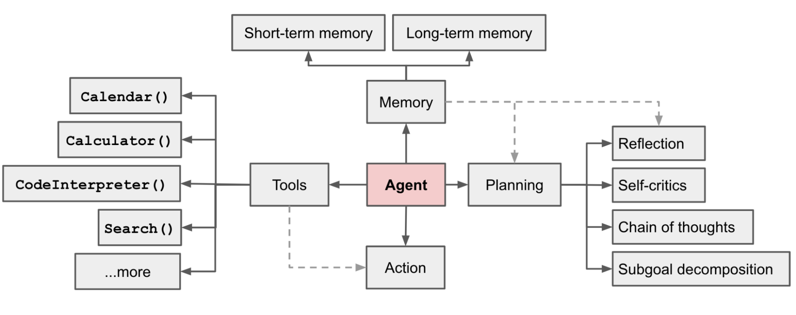

# Sayvai

## Problem Statement
- We are living in a world where we are surrounded by a lot of information.
- We are not able to process all the information and make decisions.
- We need a system that can help us to process the information and make decisions.
- not only that we need a system that can help us to make decisions based on our past decisions.
- modern day assistants like google assistant, alexa, siri are not able to do that.
- huge crowd management is not possible without assistants.

## Solution
- We need a system that can help us to process the information and make decisions.

## Objective
- To build an AI system that can help us to process the information and make decisions.
- To build an AI system that can help us to make decisions based on our past decisions.
- To build an AI system that can assist us in crowd management.
- To build an AI system that can keep track of our daily activities and help us to make decisions.

## Implementation
- We will be using the following technologies to build the system.
* Python ( programming language )
* Torch - Pytorch ( framework )
* FastAPI ( web framework )
* Docker ( containerization )
* Kubernetes ( container orchestration )
* Calender API ( google calender )
* Speech to text API ( google speech to text / whisper )
* Text to speech API ( Eleven Labs )

## Architecture
- The system will be built using the following architecture.

[source](https://lilianweng.github.io/posts/2023-06-23-agent/) of the image

## Who can use this system?
- Anyone who wants to make decisions based on their past decisions.
- Anyone who wants to keep track of their daily activities.
- Anyone who wants to manage a crowd.
- Anyone who wants a personal assistant.
- and we are researching on how to make this system available for everyone.

## How to use this system?
- The system will be available as a web application.
- The system will be available as a mobile application. ( android / ios ) `soon in the future`
- The system will be available as a desktop application. ( windows / mac ) `soon in the future`
- The system will be available as a voice assistant. ( google assistant / alexa / siri ) `soon in the future`

## How to contribute to this project?
- You can contribute to this project by creating issues.
- You can contribute to this project by creating pull requests.
- You can contribute to this project by creating a fork of this project.

## How to contact the author?
- You can contact the author by sending an email by clicking [here](mailto:sanjaypranav@sayvai.io)

## who are we ?
- we own a company called [SayvAI](https://sayvai.io) which is a startup that is building AI systems that helps to solve real world problems.

## License
- This project is licensed under [MIT License](../MIT-LICENSE.md)